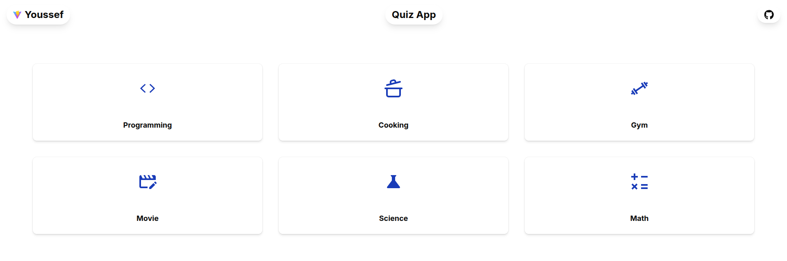

# Countdown Timer

A simple browser-based countdown timer application built with React, TypeScript, and modern UI tools.

[Live Demo →](https://logwithjo.github.io/Quiz)




## About

This is my second mini project in my React learning roadmap.

The main goal of this project was practice on how build small systems on paper before write my first line code

In my first of journey i was thinking that coders open vs and start code but now by watching on a lot of coders i knew that project starts with pin and paper not code so i started learning code patterns and reading books like think like a programmer and watching on courses like cs50 to learn how to design this systems

by the next rest of journey i will focus on building games not webs to understand how to build complex systems like score and interactions so i will go deep in this concept
---

## Features

* choose what concept you want to start on
* answer the question
* score appears immdediatly

---

## Built With

* **HTML5** — page structure
* **CSS3** — styling
* **TailwindCSS** — UI design
* **TypeScript** — type safety and application logic
* **React** — component-based UI development
* **JavaScript** — core language functionality

---

## Getting Started

Just open the live version:

[Launch App →](https://logwithjo.github.io/Quiz)

---

## Project Structure

```text
QuizApp/
├─ index.html
├─ package.json
├─ vite.config.ts
├─ tsconfig*.json
├─ src/
│  ├─ main.tsx
│  ├─ App.tsx
│  ├─ index.css
│  ├─ assets/
│  │  ├─ atom.png
│  │  ├─ calculating.png
│  │  ├─ cooking (1).png
│  │  ├─ python.png
│  │  ├─ react.svg
│  │  ├─ video.png
│  │  ├─ web-programming.png
│  │  ├─ weight.png
│  ├─ components/
│  │  ├─ theme-provider.tsx
│  │  └─ ui/
│  │     ├─ button.tsx
│  │     ├─ card.tsx
│  │     ├─ spinner.tsx
│  │     └─ sonner.tsx
│  ├─ context/
│  │  └─ AppContext.tsx
│  ├─ lib/
│  │  └─ utils.ts
│  ├─ Pages/
│  │  ├─ Home/
│  │  │  ├─ Home.tsx
│  │  │  ├─ Header.tsx
│  │  │  └─ Cards.tsx
│  │  ├─ Questions/
│  │  │  ├─ Questions.tsx
│  │  │  └─ ActionButtons.tsx
│  │  └─ Score/
│  │     └─ Score.tsx
│  └─ Types/
│     └─ Project.tsx
└─ public/
   ├─ data.json
   ├─ vite.svg
   └─ (other public assets)
```

---

## What I Learned

* Planing the whole system before
* Creating cleaner UI for a better user experience
* Writing cleaner and more maintainable code for future improvements

> Tomorrow will be better.
